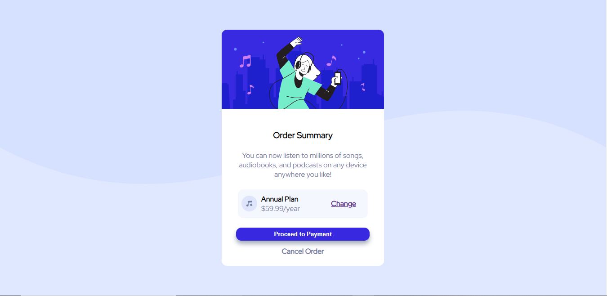
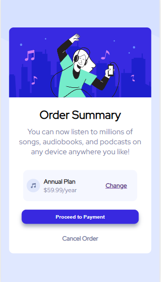

# Frontend Mentor - Order summary card solution

This is a solution to the [Order summary card challenge on Frontend Mentor](https://www.frontendmentor.io/challenges/order-summary-component-QlPmajDUj). Frontend Mentor challenges help you improve your coding skills by building realistic projects.

## Table of contents

- [Overview](#overview)
  - [The challenge](#the-challenge)
  - [Screenshot](#screenshot)
  - [Links](#links)
- [My process](#my-process)
  - [Built with](#built-with)
  - [What I learned](#what-i-learned)
  - [Continued development](#continued-development)
  - [Useful resources](#useful-resources)
- [Author](#author)
- [Acknowledgments](#acknowledgments)

## Overview

### The challenge

Users should be able to:

- See hover states for interactive elements.

- Navigate through the page easily.

- See the elements on the page i.e. the page should have a very good UI.

The webpage should be:

- Responsive on various devices.

### Screenshot





These are screenshots from the webpage.

### Links

- Solution URL: [Add solution URL here](https://your-solution-url.com)
- Live Site URL: [Add live site URL here](https://your-live-site-url.com)

## My process

### Built with

- Semantic HTML5 markup
- CSS custom properties
- Flexbox
- CSS Grid
- Visual studio code
- [Downloaded Fonts](https://fonts.google.com/) - For fonts

### What I learned

```html
<div class="empty"></div>
```

```css
.plan-type::first-line {
  font-weight: var(--fontWeight3);
}
```

```css
:root {
  --PimarypaleBlue: hsl(225, 100%, 94%);
  --PrimarybrightBlue: hsl(245, 75%, 52%);
  --NeutralveryPaleblue: hsl(225, 100%, 98%);
  --Neutraldesaturatedblue: hsl(224, 23%, 55%);
  --darkBlue: hsl(223, 47%, 23%);
  --fontsizeparagraph: 16px;
  --fontFamily: redhat;
  --fontWeight1: 500;
  --fontWeight2: 700;
  --fontWeight3: 900;
}
```

### Continued development

I plan on working on my css more as I am still not conversant with a lot of css properties.

### Useful resources

- [Stack overflow](https://stackoverflow.com/) - This helped me understand grids more and i also got a lot of peoples perspective on grids.

- [MDN](https://developer.mozilla.org/en-US) - This is an amazing website which helped me understand the minmax property in grids. If you have any problems with that topic do check this site out.

## Author

- Instagram - [Mystery_artboy](https://www.instagram.com/mystery_artboy/)
- Linkedin - [@Teedave](https://www.linkedin.com/in/tosin-arowolo-533195240)
- Twitter - [@rengvsed](https://twitter.com/rengvsed)

## Acknowledgments

Shout out to Biri even though he probably wont see this and shout out to God for helping me through this project.
